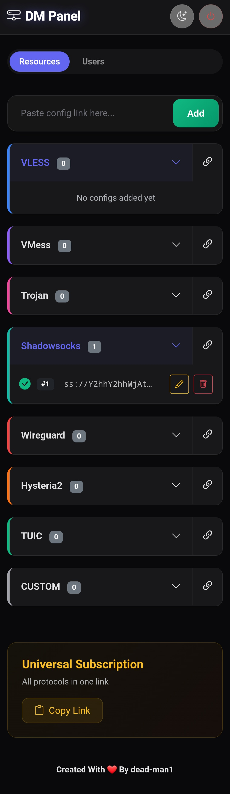
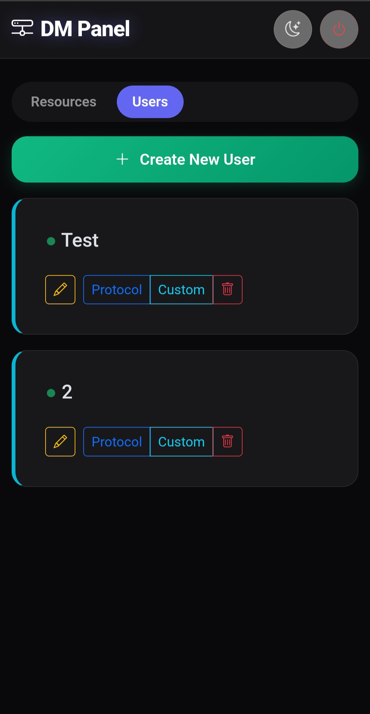

# 🛡️ DM Panel
**Modern, Stealthy & Powerful Subscription Manager for Cloudflare Workers**

  
  

---

DM Panel is a powerful, stealthy, and modern subscription manager for Cloudflare Workers. It allows you to manage VLESS, VMess, Trojan, Shadowsocks, WireGuard, Hysteria2, TUIC, and Custom JSON configs in a secure and user-friendly interface.

---

## ✨ Features

* **Stealth Mode:** The root URL displays a fake Nginx Welcome Page to hide the panel's existence.
* **Modern UI:** Glassmorphism design, dark/light mode, and smooth animations.
* **Protocol Support:** VLESS, VMess, Trojan, Shadowsocks, WireGuard, Hysteria2, TUIC.
* **Custom Configs:** Full support for Custom JSON configs (Sing-box, etc.) with a smart editor.
* **Universal Subscription:** Auto-generated MIX subscription link for all standard protocols.
* **User Management:** Create multiple users with specific access to protocols and configs.
* **Secure Login:** Password-protected panel with session management.
* **Cloudflare KV:** Uses KV storage for persistent data.

## 🚀 Installation

1. **Create a Worker:** Go to Cloudflare Dashboard > Workers & Pages > Create Application > Create Worker.
2. **Create KV Namespace:** Go to Workers & Pages > KV > Create a Namespace (e.g., named `KV`).
3. **Bind KV:** Go to your Worker > Settings > Variables > KV Namespace Bindings.
    * Variable name: `KV`
    * KV Namespace: Select the one you created.
4. **Set Environment Variables:** Go to Settings > Variables > Environment Variables. Add:
    * `PASS`: Your admin password (e.g., `MySecretPass123`).
    * `SUB_PATH`: A secret path for subscription links (e.g., `my-secret-sub-path`).
5. **Deploy Code:** Copy the content of `worker.js` from this repository and paste it into your Worker's code editor. Save and Deploy.

## 📖 Usage

1. **Access Panel:** Open `https://your-worker.workers.dev/panel`.
2. **Login:** Enter the password you set in the `PASS` variable.
3. **Add Configs:** Paste your config links (`vless://`, `vmess://`, etc.) or JSON objects and click **Add**.
4. **Manage Users:** Go to the **Users** tab to create users and assign specific configs.
5. **Get Links:**
    * Click the **Copy** icon next to each protocol for specific subscriptions.
    * Use the **Universal Subscription** card at the bottom for a mixed link.

## 🔒 Security Note

* The root URL (`/`) shows a fake Nginx page.
* Subscription links are accessible only via the `SUB_PATH` you defined.
* The API is protected by token authentication.

---

Created with ❤️ by <a href="https://github.com/dead-man1">dead-man1</a>

